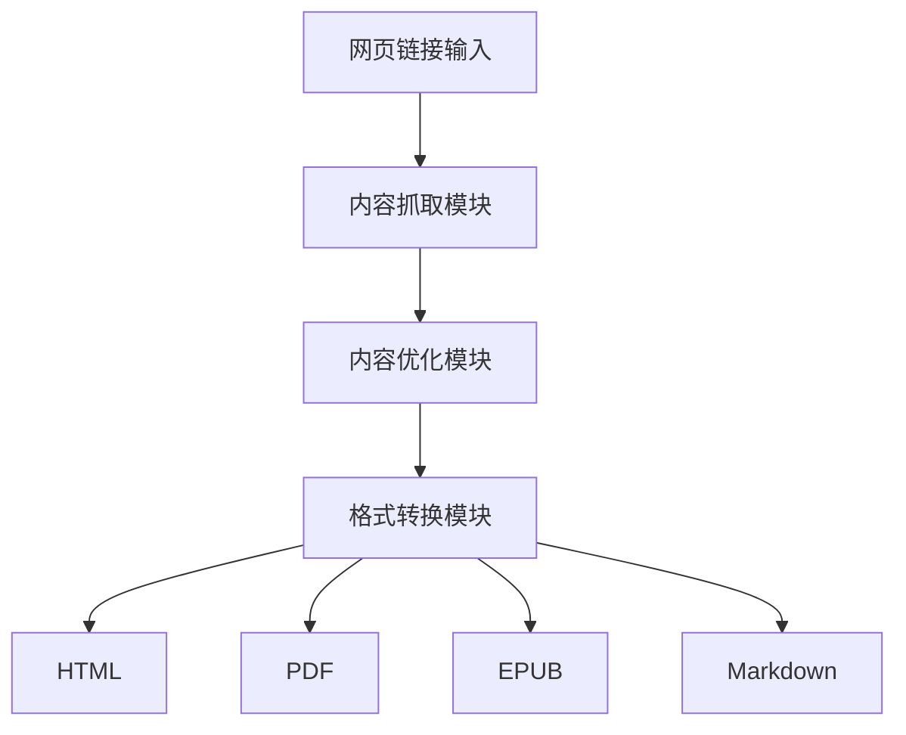
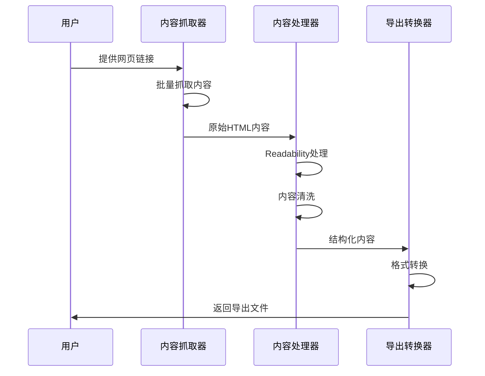
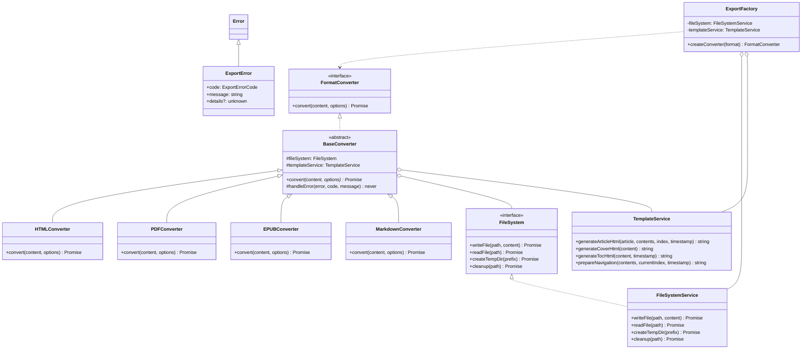

# WePub

WePub 是一个基于 Next.js 构建的现代网页内容阅读优化工具。它能将任何网页转换为清晰、易读的文章格式，支持批量抓取和多种格式导出，让您的阅读体验更加舒适。

## 📖 项目概述

WePub 主要解决以下问题：
- 网页内容阅读体验差
- 多页面内容难以整合
- 内容格式难以统一
- 离线阅读需求难以满足

## 🏗️ 系统架构

### 整体架构



### 内容处理流程



### 模块结构



## 🛠️ 技术栈

- **前端框架**：Next.js 14 (App Router)
- **样式方案**：Tailwind CSS + shadcn/ui
- **内容处理**：Mozilla Readability
- **文档转换**：Percollate
- **类型系统**：TypeScript
- **部署平台**：Vercel

## 📦 项目结构

```
src/
├── app/                    # Next.js 应用目录
│   ├── api/               # API 路由
│   │   └── export/       # 导出相关接口
│   │       └── route.ts  # 导出处理路由
│   │   └── crawl/        # 抓取相关接口
│   │       └── route.ts  # 抓取处理路由
│   │   └── parse/        # 解析相关接口
│   │       └── route.ts  # 解析处理路由
│   └── page.tsx          # 主页面
├── components/            # React 组件
│   ├── ArticleConverter.tsx # 文章转换器组件
│   ├── ExportDialog.tsx     # 导出对话框组件
│   ├── SiteCrawler.tsx # 网站抓取器组件
│   ├── ThemeProvider.tsx # 主题提供者组件
│   ├── ThemeToggle.tsx # 主题切换组件
│   └── ui/               # UI 基础组件
├── core/                  # 核心接口和类型定义
│   ├── errors/           # 错误处理
│   │   └── export.error.ts # 导出相关错误定义
│   └── interfaces/       # 接口定义
│       ├── content.interface.ts    # 内容相关接口
│       └── converter.interface.ts  # 转换器接口
├── services/             # 服务层
│   ├── converters/      # 格式转换器
│   │   ├── base.converter.ts    # 基础转换器
│   │   ├── html.converter.ts    # HTML转换器
│   │   ├── pdf.converter.ts     # PDF转换器
│   │   ├── epub.converter.ts    # EPUB转换器
│   │   └── markdown.converter.ts # Markdown转换器
│   ├── export.factory.ts # 导出工厂
│   ├── file.service.ts  # 文件服务
│   └── template.service.ts # 模板服务
└── styles/              # 样式定义
    └── index.ts        # 样式导出
```

### 目录说明

#### 1. `src/` - 源代码目录
- **app/**: Next.js 应用主目录，包含页面和API路由
- **components/**: React 组件库，包含 UI 基础组件和业务组件
- **core/**: 核心接口和类型定义，确保系统的可扩展性
- **services/**: 业务服务层，包含各种格式转换器和工具服务
- **styles/**: 全局样式定义，包含各种主题和组件样式

### 关键文件说明

1. **转换器相关**
   - `base.converter.ts`: 定义基础转换器抽象类
   - `html.converter.ts`: HTML格式转换实现
   - `pdf.converter.ts`: PDF格式转换实现
   - `epub.converter.ts`: EPUB格式转换实现
   - `markdown.converter.ts`: Markdown格式转换实现

2. **服务类**
   - `export.factory.ts`: 转换器工厂，负责创建对应格式的转换器
   - `file.service.ts`: 文件操作服务，处理文件读写
   - `template.service.ts`: 模板服务，生成各种格式的模板

3. **接口定义**
   - `content.interface.ts`: 内容相关接口定义
   - `converter.interface.ts`: 转换器接口定义

4. **错误处理**
   - `export.error.ts`: 导出相关错误类型定义

## 🚀 安装指南

### 环境要求

- Node.js >= 18.0
- npm >= 8.0 或 yarn >= 1.22
- Git >= 2.0
- percollate (用于PDF和EPUB转换)

### 安装步骤

1. **安装 Node.js 和 npm**
   ```bash
   # 检查版本
   node -v
   npm -v
   ```

2. **安装 percollate**
   ```bash
   npm install -g percollate
   ```

3. **克隆项目**
   ```bash
   git clone https://github.com/yourusername/wepub.git
   cd wepub
   ```

4. **安装依赖**
   ```bash
   npm install
   # 或
   yarn install
   ```

5. **环境配置**
   ```bash
   # 复制环境变量模板
   cp .env.example .env.local
   
   # 编辑环境变量
   vim .env.local
   ```

6. **启动开发服务器**
   ```bash
   npm run dev
   # 或
   yarn dev
   ```

7. **构建生产版本**
   ```bash
   npm run build
   npm start
   ```

## 💻 开发指南

### 代码规范

- 使用 ESLint 进行代码检查
- 使用 Prettier 进行代码格式化
- 遵循 TypeScript 类型检查

### 转换器开发

如需添加新的导出格式，需要：

1. 在 `src/core/interfaces/converter.interface.ts` 中定义接口
2. 在 `src/services/converters/` 下创建新的转换器类
3. 继承 `BaseConverter` 类并实现 `convert` 方法
4. 在 `ExportFactory` 中注册新的转换器

示例：
```typescript
export class NewFormatConverter extends BaseConverter {
  async convert(content: Content, options?: ConvertOptions): Promise<Buffer> {
    // 实现转换逻辑
  }
}
```

## 🤝 贡献指南

1. Fork 本项目
2. 创建特性分支 (`git checkout -b feature/AmazingFeature`)
3. 提交改动 (`git commit -m 'Add some AmazingFeature'`)
4. 推送到分支 (`git push origin feature/AmazingFeature`)
5. 提交 Pull Request

### 提交规范

- feat: 新功能
- fix: 修复问题
- docs: 文档修改
- style: 代码格式修改
- refactor: 代码重构
- test: 测试用例修改
- chore: 其他修改

## 📄 许可证

本项目采用 MIT 许可证 - 查看 [LICENSE](LICENSE) 文件了解详情

## 🙏 鸣谢

- [Next.js](https://nextjs.org/)
- [Tailwind CSS](https://tailwindcss.com/)
- [shadcn/ui](https://ui.shadcn.com/)
- [Mozilla Readability](https://github.com/mozilla/readability)
- [Percollate](https://github.com/danburzo/percollate)